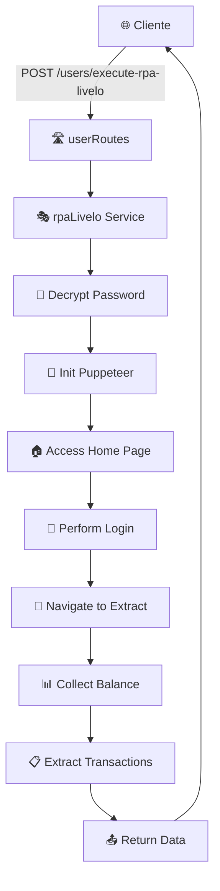

# 🤖 RPA Livelo Service

[](https://www.typescriptlang.org/)
[](https://nodejs.org/)
[](https://expressjs.com/)
[](https://puppeteer.sh/)

> 🚀 **Serviço de automação RPA para extração de dados do Livelo** - Uma API REST robusta e eficiente para automatizar a coleta de transações e saldo de pontos da plataforma Livelo.

## ✨ Funcionalidades

🎯 **Principais recursos:**

- ⚡ **Automação completa** do processo de login no Livelo
- 📊 **Extração de saldo** de pontos em tempo real
- 💳 **Coleta de transações** detalhadas do extrato
- 🔐 **Sistema de criptografia** para senhas seguras
- 📚 **Documentação Swagger** integrada
- 🛡️ **Tratamento de erros** robusto
- 🔄 **Logs detalhados** de cada etapa do processo

## 🏗️ Arquitetura do Projeto

```
📦 rpa-livelo-service
├── 📁 src/
│   ├── 📄 index.ts          # Entrada principal da aplicação
│   ├── 📁 config/           # Configurações
│   │   ├── 🔑 crypto.ts     # Config de criptografia
│   │   └── 📖 swagger.ts    # Config da documentação
│   ├── 📁 helpers/          # Utilitários
│   │   ├── 🔐 crypto.ts     # Funções de criptografia
│   │   └── 🤖 puppteer.ts   # Configuração do Puppeteer
│   ├── 📁 routes/           # Rotas da API
│   │   └── 🛣️ userRoutes.ts # Endpoints principais
│   └── 📁 services/         # Lógica de negócio
│       ├── 📋 @type.ts      # Tipos TypeScript
│       └── 🎭 rpaLivelo.ts  # Automação principal
└── 📄 README.md
```

## 🚀 Como Usar

### 📋 Pré-requisitos

- 📦 **Node.js** >= 16.0.0
- 🔧 **npm** ou **yarn**
- 🌐 **Chrome/Chromium** instalado

### ⚙️ Instalação

1. **Clone o repositório**

```bash
git clone https://github.com/montanari2019/rpa_livelo_service.git
cd rpa_livelo_service
```

2. **Instale as dependências**

```bash
npm install
```

3. **Configure as variáveis de ambiente**

```bash
cp .env.example .env
```

4. **Edite o arquivo `.env`** com suas configurações:

```env
ENCRYPTION_KEY=sua-chave-de-32-caracteres-aqui
CRYPTO_ALGORITHM=aes-256-gcm
CRYPTO_KEY_LENGTH=32
CRYPTO_IV_LENGTH=16
CRYPTO_TAG_LENGTH=16
CRYPTO_SALT_LENGTH=32
```

### 🏃‍♂️ Executando

**Modo desenvolvimento:**

```bash
npm run dev
```

**Build e produção:**

```bash
npm run build
npm start
```

### 🐳 Docker

**Build com Docker:**

```bash
docker build -t rpa_livelo_service .
```

**Executando com Docker:**

```bash
docker run -d --name rpa_livelo_service -p 3000:3000 rpa_livelo_service
```

**Com variáveis de ambiente personalizadas:**

```bash
docker run -d --name rpa_livelo_service \
  -p 3000:3000 \
  -e PORT=3000 \
  -e CRYPTO_KEY=sua-chave-aqui \
  rpa_livelo_service
```

## 📡 API Endpoints

### 🔍 Documentação Swagger

Acesse a documentação interativa em: `http://localhost:3000/docs`

### 🛠️ Endpoints Disponíveis

#### `GET /users`

- ✅ Endpoint de teste para verificar se a API está funcionando

#### `POST /users/execute-rpa-livelo`

- 🤖 Executa o processo RPA completo do Livelo
- 📥 **Parâmetros:**
  ```json
  {
    "userName": "seu-email@exemplo.com",
    "passwordCrypto": "senha-criptografada",
    "startOrder": 1
  }
  ```
- 📤 **Resposta:**
  ```json
  {
    "success": true,
    "data": {
      "balance": 15000,
      "transactions": [
        {
          "data": "2024-01-15",
          "operacao": "Acúmulo",
          "parceiros": "Partner Store",
          "pontos": 500,
          "observacoes": "Compra realizada"
        }
      ]
    }
  }
  ```

## 🔐 Segurança

- 🛡️ **Criptografia AES-256-GCM** para senhas
- 🔑 **Variáveis de ambiente** para configurações sensíveis
- 🚫 **Não armazena credenciais** em logs
- ⏰ **Timeouts configuráveis** para evitar travamentos

## 🎭 Como Funciona o RPA

1. **🏠 Acesso à página inicial** - Limpa cookies e localStorage
2. **🔐 Processo de login** - Automação humanizada de digitação
3. **🧭 Navegação para extrato** - Acessa área de transações
4. **📊 Coleta de saldo** - Extrai informações de pontos
5. **📋 Extração de transações** - Coleta dados do extrato
6. **🔄 Processamento** - Organiza e retorna dados estruturados

## 🚀 Deploy no Render

### 📝 Configuração no Render:

1. **Build Command:** `npm install`
2. **Start Command:** `npm start`
3. **Environment:** Node.js
4. **Variables:** Configure as variáveis do `.env`

### 🔧 Variáveis de Ambiente no Render:

```
ENCRYPTION_KEY=sua-chave-de-32-caracteres-aqui
CRYPTO_ALGORITHM=aes-256-gcm
CRYPTO_KEY_LENGTH=32
CRYPTO_IV_LENGTH=16
CRYPTO_TAG_LENGTH=16
CRYPTO_SALT_LENGTH=32
```

## 🛠️ Tecnologias Utilizadas

| Tecnologia                                                                                                | Versão   | Descrição              |
| --------------------------------------------------------------------------------------------------------- | -------- | ---------------------- |
|  | ^5.9.2   | Linguagem principal    |
|           | ^5.1.0   | Framework web          |
|     | ^24.17.1 | Automação do navegador |
|           | ^6.2.8   | Documentação da API    |
|           | >= 16    | Runtime JavaScript     |

## 📊 Fluxo de Dados



## 🔍 Estrutura de Tipos

```typescript
// Credenciais para login
interface LiveloCredentialsType {
  userName: string;
  password: string;
}

// Transação do extrato
interface ExtratTransactionType {
  data: string;
  operacao: string;
  parceiros: string;
  pontos: number;
  observacoes: string;
}

// Resposta do processo
interface ProcessQueueRoutineResponse {
  success: boolean;
  step_title: string;
  messages: ProcessQueueRoutineMessages;
}
```

## 📈 Status do Projeto

- ✅ **Funcional** - API operacional
- ✅ **Documentado** - Swagger integrado
- ✅ **Tipado** - TypeScript 100%
- ✅ **Seguro** - Criptografia implementada
- ✅ **Deploy-ready** - Configurado para Render

## 🤝 Contribuição

1. 🍴 **Fork** o projeto
2. 🌟 **Crie** uma branch para sua feature (`git checkout -b feature/AmazingFeature`)
3. 💾 **Commit** suas mudanças (`git commit -m 'Add some AmazingFeature'`)
4. 📤 **Push** para a branch (`git push origin feature/AmazingFeature`)
5. 🔄 **Abra** um Pull Request

## 📝 Logs e Monitoramento

O serviço possui sistema de logs detalhado que registra:

- 🔍 **Cada etapa** do processo RPA
- ⚠️ **Erros** com stack trace
- ⏱️ **Timing** de execução
- 📊 **Dados coletados**

## ⚠️ Considerações Importantes

- 🕐 **Rate Limiting**: Respeite os termos de uso da Livelo
- 🔒 **Credenciais**: Use sempre senhas criptografadas
- 🌐 **Network**: Requer conexão estável com a internet
- 💾 **Memória**: Puppeteer requer recursos adequados

## 📧 Contato

**Desenvolvido por:** [Ikaro Montanari](https://github.com/montanari2019)

---

<div align="center">

**⭐ Se este projeto foi útil, considere dar uma estrela! ⭐**

[](https://github.com/montanari2019/rpa_livelo_service)
[](https://github.com/montanari2019/rpa_livelo_service)

</div>

## 📄 Licença

Este projeto está sob a licença ISC. Veja o arquivo [LICENSE](LICENSE) para mais detalhes.

---

<div align="center">
  <sub>🤖 Automatizando o futuro, uma linha de código por vez! 🚀</sub>
</div>
